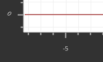
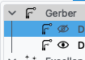

# Changelog

All notable changes to this project will be documented in this file.

The format is based on [Keep a Changelog](https://keepachangelog.com/en/1.1.0/),
and this project adheres to [Semantic Versioning](https://semver.org/spec/v2.0.0.html).

## [Unreleased]

### Removed

- Removed `global_language_current` from saved settings; the Preferences language list reads the Qt `language` key

### Fixed

- Fixed Preferences showing English after another language was applied; the language list follows the language stored by Qt

## [1.9.8] - 2026-10-01

This is a developer update. Switched application settings to typed Pydantic models. Saved preferences live on `Settings`, the session copy lives on `Options`, and both share one field schema.

### Removed

- Removed the unused `AppDefaults` and `AppOptions` classes; saved settings and session values live on `Settings` and `Options`

### Added

- Added a typed Pydantic settings model containing all current factory defaults as the first stage of settings migration
- Added JSON loading and writing for the typed settings model; a failed read or write raises `SettingsError`
- Added `bind` and `unbind` so a callback can observe changes to settings and options
- Added `propagate_settings` to copy parser settings onto the Excellon, Gerber, and Geometry classes
- Added `Settings.report_usage` to count how often a tool or action is used
- Added an `Options` model for session values that start from saved settings and do not write the settings file; shared preference groups are defined once and reused by both objects
- Added `FlatCAMError` as the project base exception; settings errors inherit from it

### Changed

- Changed New Project to refresh session options from the settings already in memory
- Changed application startup to load saved settings into `Settings` and build session `Options` from them
- Changed an unreadable settings file to be deleted and replaced with the built-in defaults, with a log message

### Fixed

- Fixed canvas startup writing the axis and HUD flags through the removed defaults dictionary
- Fixed the edit handler reading usage counters from the removed defaults object
- Fixed Preferences Apply crashing on the removed `current_defaults` dictionary
- Fixed Preferences Apply dropping values when a widget returned a number, a coordinate pair, or a combo index
- Fixed quit failing when bookmarks were copied into settings as title and link pairs
- Fixed saved preferences going to a different file than startup loads, so every launch stayed a first run and the saved values did not come back
- Fixed opening a project failing when a stored Gerber color entry was a color pair plus a layer name
- Fixed opening a project failing when Gerber editor aperture dimensions were stored as two numbers
- Fixed opening a project failing when the drilling tool-change position was stored as two numbers
- Fixed opening a project failing when an isolation tool diameter was stored as a number
- Fixed opening a project failing when the milling tool-change position was stored as two numbers
- Fixed opening a project failing when a non-copper clearing tool diameter was stored as a number
- Fixed opening a project failing when solder-paste nozzle diameters were stored as a list of numbers
- Fixed opening a project failing when the solder-paste tool-change position was stored as two numbers
- Fixed opening a project failing when the transformation reference point was stored as two numbers
- Fixed tools crashing on launch because usage counters were still read from the removed defaults object
- Fixed the levelling and milling forms crashing because session options iterate as name and value pairs
- Fixed applying a language crashing on restart because session options were copied through the removed defaults object

## [1.9.7] - 2026-09-28

### Added

- Added a Getting started page that lists where Qt settings and the application data folder are stored on Windows, macOS, and Linux

### Fixed

- Fixed opening a project hanging when the legacy-project confirmation was built on a worker thread
- Fixed the Project tree using a hardcoded Segoe UI font, so it follows the system UI font and no longer warns about a missing font at startup
- Fixed the canvas HUD requesting the missing Times font; coordinate labels use Georgia when that family is installed
- Fixed axis tick labels staying black on a dark system window color in the light theme
  
  

- Fixed the tab close icon filename typo `inselected`, which made Qt warn about a missing SVG in the light and dark themes
- Fixed a bus error on quit with no project open: on macOS the process exits after saving state and releasing multiprocessing semaphores, before Qt destroys the OpenGL canvas

## [1.9.6] - 2026-09-22

### Added

- Added GitHub Actions packaging for Windows, Linux, macOS Intel and macOS Apple Silicon (conda-pack; macOS ships as a DMG)
- Added a visibility eye icon in the Project tree between the object-type icon and the name (Gerber, Excellon, Geometry, CNC Job), following the light and dark tree colors

  

### Fixed

- Fixed a Python 3.11 SyntaxError in NCC tool add (`f-string` with a backslash) that stopped the packaged app at import
- Fixed GitHub Actions uploading the intermediate conda-pack `env.tar.gz` next to the real package; only `FlatCAM-*` archives are published
- Fixed the macOS app quitting silently when started from the read-only DMG or when Python failed: the launcher now requires a writable copy in Applications, runs `conda-unpack` for real, and shows an alert
- Fixed Linux/Windows/macOS packaging calling `python -m conda_pack`, which has no `__main__` module; the build now runs the `conda-pack` CLI
- Fixed the conda environment numpy/ortools conflict by requiring numpy 2.x, so isolation routing can import after a fresh env create
- Fixed Project tree range-selecting other layers when clicking a visibility eye while another row was already selected

## [1.9.0] - 2026-09-08

### Added

- Added a developer launch mode (`./scripts/dev.sh`) that prints exception traces and the segfault stack to the terminal and `tmp/last_trace.txt`

### Fixed

- Fixed a segfault when selecting an object: Properties UI is swapped inside a host widget instead of `QScrollArea.takeWidget()`, which destroyed the still-referenced form in PyQt6
- Fixed Tcl `cncjob` failing with KeyError `tools_mill_laser_on` on older geometry tool data

## [0.0.0] - 2026-09-07

### Added

- Start
