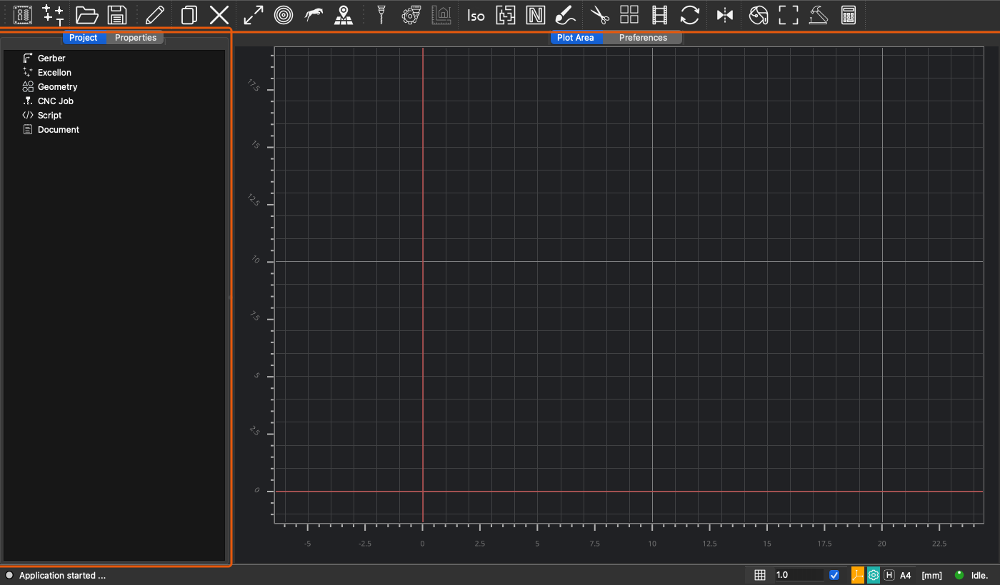
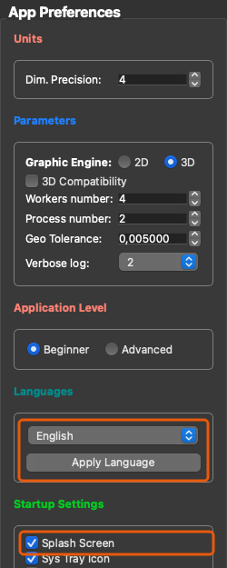
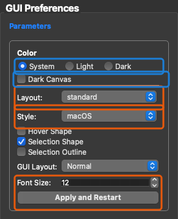
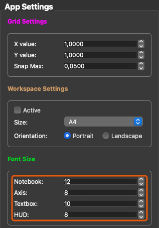

# Settings

FlatCAM keeps its settings in two stores. They differ in where the values live and what reads them.

| Store | Class | Where it lives | What it holds |
|---|---|---|---|
| Preferences file | `Settings`, with the session copy `Options` (`source/settings/models`) | `current_defaults_<version>.FlatConfig` in the data folder | units, plotting, Gerber, Excellon, geometry, CNC job, and tool parameters |
| GUI store | `GuiSettings` (`source/settings/gui_settings.py`) | Qt `QSettings("Open Source", "FlatCAM_EVO")` | main window layout, widget style, language, font sizes, splash screen |

The Preferences file belongs to the project data. It can be exported, imported, and restored to defaults. The GUI store describes this installation's window and its look. **Clear GUI Settings** in Preferences empties it without touching the Preferences file.

| Question | Read and write |
|---|---|
| What should a tool or object use in this session? | `app.options` |
| What did the user save in Preferences, and what comes back on the next launch? | `app.settings`, file `current_defaults_<version>.FlatConfig` |
| Window layout, widget style, language, font sizes? | `GuiSettings()` |

## Preferences file: `Settings` and `Options`

`Settings` and `Options` answer different questions.

### `Settings`

Saved application settings. They are loaded from `current_defaults_<version>.FlatConfig` and written back when the user saves preferences. A missing file is created from the built-in defaults. A file that cannot be read is deleted and replaced with those defaults; the replacement is written to the log. The file-format `version` and the usage counters in `global_stats` belong here.

### `Options`

Session values used by tools, editors, and the open project. `Options.from_settings()` builds them from the saved settings. After that they may diverge: a theme choice or a loaded project changes options and does not write the settings file.

Options do not repeat the settings schema. Shared preference groups are defined once and inherited by both objects:

- application behavior: units, workers, autosave
- interface: theme, canvas, grid, cursor, layout
- Gerber, Excellon, geometry, and CNC job
- each tool
- file associations, scripts, and documents

`version` and `global_stats` stay on `Settings` only.

### Current application stores

`App` stores saved settings on `self.settings` and the session copy on `self.options`.

`app.options` is the working copy. `app.settings` is the saved Preferences. They start as a copy of each other and then diverge. Writing one does not write the other.

### `app.settings`

`App` creates this in `App.__init__` (`source/appMain.py`).

Saved settings are a `Settings` model on `app.settings` (`source/settings`). Field defaults are the built-in starting set. `App.load_settings()` reads `current_defaults_<version>.FlatConfig` from the data folder and keeps a field default when a key is absent.

Data folder:

- Windows, normal install: `%APPDATA%/FlatCAM`
- Windows, portable: `<app>/config`
- macOS and Linux: `~/.FlatCAM`

The settings file name uses the application version, `App.version`, as in `current_defaults_Unstable.FlatConfig`. The `version` field inside the file is the data-format version and is not part of the file name.

`PreferencesUIManager.current_defaults` is an in-memory `Settings` snapshot used to undo an unsaved Preferences edit. It is not the file.

Startup no longer writes `factory_defaults_<version>.FlatConfig`. Built-in defaults are the field defaults on `Settings`.

### `app.options`

Session options are an `Options` model. Startup builds them with `Options.from_settings(self.settings)`, which copies the shared fields.

Tools, editors, and objects read and write `app.options`. That value lives for this process. It is not the Preferences file.

A new object copies the keys it needs into its own `obj_options`. That dictionary belongs to the object. Changing it does not change `app.options` or the file.

### When the two dictionaries are copied

They are copied only at these points.

**Startup.** `App.load_settings()` reads the FlatConfig file into `Settings`, then `Options.from_settings()` copies the shared fields into `app.options`.

**Apply in Preferences** (`PreferencesUIManager.on_save_button`):

1. `defaults_read_form()` writes the form into `app.settings`. Only keys listed in `settings_from_fields` are read.
2. `copy_shared(app.options, app.settings)` copies those fields onto the session.
3. `save_defaults()` writes `app.settings` to `current_defaults_<version>.FlatConfig`.

**File → Save Defaults** (`AppIO.on_file_save_defaults`) copies `app.options` onto `app.settings`, then writes the settings file.

**Close Preferences without saving** restores the form and `app.settings` from `PreferencesUIManager.current_defaults`. `app.options` is left as it was.

**New Project** does not read the settings file again. `on_settings2options()` reads the form into `app.settings` and copies `app.settings` over `app.options`.

`copy_shared()` deep-copies each shared field, so `app.settings` and `app.options` do not share nested lists or dictionaries. The startup copy does the same. A later in-place edit of one model is not visible from the other.

### Preferences form

`PreferencesUIManager.settings_from_fields` maps an option key to a widget. Apply reads that map into `app.settings`. Keys absent from the map are never taken from the form, so they stay at the factory or file value and are still written out with the rest of `app.settings`.

Opening Preferences fills the form from `app.settings` (`defaults_write_form`). A change callback on `app.options` can push a single key back into the matching widget (`App.on_defaults_dict_change`). The widget is not a store.

Some color controls write `app.options` as the color changes, before Apply. That updates the session immediately. The file still changes only when Apply or Save Defaults runs.

`propagate_settings()` copies a few keys (`excellon_*`, `gerber_use_buffer_for_union`, `geometry_multidepth`) onto the class-level defaults of the Gerber, Excellon, and Geometry parsers. That path is separate from `app.options`.

## GUI store: `GuiSettings`

`GuiSettings` is the only way the application reads and writes `QSettings("Open Source", "FlatCAM_EVO")`. It is a process-wide singleton: `GuiSettings()` returns the same object everywhere. Each key has a named getter and a `save_*` method, so call sites do not repeat `contains()` and `value()` with a default. The generic `contains`, `value`, `set_value`, `remove`, `keys`, and `clear` remain for tests and for `clear()` on the first run.

Qt keeps this store outside the FlatConfig file:

- Windows: registry key `HKEY_CURRENT_USER\Software\Open Source\FlatCAM_EVO`
- macOS: `~/Library/Preferences/com.open-source.FlatCAM_EVO.plist`
- Linux: `~/.config/Open Source/FlatCAM_EVO.conf`

The Qt store is opened on the first read or write. Qt deletes a `QSettings` object created before `QApplication`, and translation code reads the language that early, so `GuiSettings` reopens the store when it finds the old one deleted. Every write is synced at once, because the instance lives until the process ends.

### What it stores in the interface

On the screenshots, an orange frame marks a value that lives only in `GuiSettings`. A blue frame marks Color and Dark Canvas. Those controls are saved in the Preferences file. Startup also writes the resolved session color into `GuiSettings`.

**Main window.** The toolbar positions and the dock state (`saved_gui_state`), the window position and size (`window_geometry`), whether the window was maximized (`maximized_gui`), and the width of the left panel (`splitter_left`). The toolbar context menu holds the toolbar lock (`toolbar_lock`) and the text under toolbar icons (`menu_show_text`).

**Preferences → General → App Preferences.** The interface language and the splash screen.

**Preferences → General → GUI Preferences.** Orange: toolbar layout, the Qt widget style, and the application font size. Those exist only in `GuiSettings`. Blue: Color and Dark Canvas. The file stores `global_appearance` and `global_dark_canvas` on `app.settings`. Startup resolves Color to `light` or `dark` and writes that into `GuiSettings` as `theme`, and copies `appearance` and `dark_canvas` there too.

**Preferences → General → App Settings.** Font sizes of the notebook, the canvas axis, text boxes, and the HUD.

### Keys

| Key | Read | Write | Default when absent |
|---|---|---|---|
| `style` | `style_name()`, `apply_style()` | `save_style()` | current Qt style |
| `font_size` | `font_size()`, `apply_font_size()` | `save_font_size()` | Qt default font |
| `notebook_font_size` | `notebook_font_size()` | `save_notebook_font_size()` | 12 |
| `axis_font_size` | `axis_font_size()` | `save_axis_font_size()` | 8; the VisPy canvas passes 6 |
| `textbox_font_size` | `textbox_font_size()` | `save_textbox_font_size()` | 10; the Tcl shell passes 9 |
| `hud_font_size` | `hud_font_size()` | `save_hud_font_size()` | 8; the legacy canvas scales it by 2.5 |
| `language` | `language()` | `save_language()` | English, stored on first read |
| `layout` | `layout()` | `save_layout()` | `standard`, stored when the main window is built |
| `splash_screen` | `splash_screen()` | `save_splash_screen()` | shown, stored on first start |
| `theme` | `theme()` | `save_theme()` | `Theme.LIGHT`. Written at startup from `options.global_theme`; not a field of `Settings` |
| `appearance` | `appearance()` | `save_appearance()` | None. Session copy of `settings.global_appearance` |
| `dark_canvas` | `dark_canvas()` | `save_dark_canvas()` | None. Session copy of `settings.global_dark_canvas` |
| `saved_gui_state` | `saved_gui_state()` | `save_gui_state()` | Qt default dock layout |
| `maximized_gui` | `maximized_gui()` | `save_maximized_gui()` | not maximized |
| `window_geometry` | `window_geometry()` | `save_window_geometry()` | `(100, 100, 800, 400)` |
| `splitter_left` | `splitter_left()` | `save_splitter_left()` | 1 |
| `toolbar_lock` | `toolbar_lock()` | `save_toolbar_lock()` | locked |
| `menu_show_text` | `menu_show_text()` | `save_menu_show_text()` | text shown |

A getter that returns None leaves the choice to the call site. The call site then keeps its own default, as with the shell font size.

### When it is read and written

**Startup** (`App.__init__`). The color scheme, the stored widget style, and the font size are applied before the splash screen, the first widget, because a style or font set later does not reach widgets already built. The session values of `appearance`, `theme`, and `dark_canvas` are then written from `app.options`. `MainGUI` restores the window state, geometry, splitter, toolbar lock, and layout.

**Style combo.** `save_style()` stores the name and applies the style at once; no restart. How that style relates to the color scheme is described below.

**Language.** **Apply Language** stores the language and restarts.

**Splash Screen checkbox.** Writes as soon as it changes.

**Layout combo.** `App.on_layout()` stores the layout and rebuilds the toolbars.

**Preferences Apply and Save** (`PreferencesUIManager.on_save_button`). A changed color, Dark Canvas, graphics engine, or application font size asks to restart. **Yes** stores the new value and restarts; **Cancel** puts the old value back in the form. The notebook, axis, text box, and HUD font sizes are stored without asking and are read by widgets built later.

**Apply and Restart** on the GUI page stores the application font size, copies the form onto the session options, and restarts at once.

**Quit.** `MainGUI.closeEvent` stores the window state, geometry, splitter, toolbar lock, and menu text. `App.quit_application` stores the window state, the maximized flag, the language, and the four font sizes again from the Preferences form.

**First run.** `app.options.first_run` clears every key.

**Clear GUI Settings.** Stores `Theme.LIGHT`, then clears every key after confirmation.

### Style and color

Style and color are separate settings. Style chooses which Qt style draws the controls. Color chooses the palette, the icon set, and the plot background. Preferences → General → GUI shows both: the **Color** radio (System, Light, Dark) and the **Style** combo.

**Style** is a `QStyle` from `QStyleFactory.keys()`. The combo lists whatever this process reports. Typical names:

| Name | What it draws |
|---|---|
| `macOS` | Native macOS controls. Present on macOS builds. |
| `Windows` | Windows-style controls, including on macOS. |
| `Fusion` | Qt's own style. The same drawing on every platform. |

The style does not pick light or dark. It only draws buttons, combo boxes, sliders, and the rest of the chrome. The color scheme supplies the palette those controls use. On macOS, the native style follows that palette: Dark uses the system dark drawing, Light uses the system light drawing.

The choice is the `style` key. It is not a field of `Settings` and it is not written to the FlatConfig file. A stored value that is not one of the available style names is ignored, and Qt keeps its default style. `App.__init__` calls `GuiSettings.apply_style()` after the color scheme and before the splash screen, the first widget, so the window is created with the saved style.

A stylesheet on the application replaces the style object. Setting a new style while a sheet is active leaves the previous style in place. `GuiSettings.set_widget_style()` clears the sheet, calls `QApplication.setStyle()`, then puts the same sheet back.

**Color** is the **Color** radio on the same page, the blue frame in the screenshot. The saved field is `global_appearance` on `Settings` (`source/settings/models/interface.py`). That field is System, Light, or Dark. It is not the `theme` key. Startup turns it into `options.global_theme` (`light` or `dark`) and `save_theme()` stores that resolved value. `save_appearance()` stores the radio value beside it, so Preferences can see that the running session differs from the form.

| Choice | Stored value | Qt color scheme | Session theme |
|---|---|---|---|
| System | `system` | `Qt.ColorScheme.Unknown` (follow the OS) | `darkdetect` decides light or dark |
| Light | `light` | `Qt.ColorScheme.Light` | light |
| Dark | `dark` | `Qt.ColorScheme.Dark` | dark |

Older files used `default` and `auto` for the same idea; both load as `system`.

Startup resolves that field once:

1. `Options.theme_from_appearance()` writes `options.global_theme` as `light` or `dark`. System follows the operating system through `darkdetect`.
2. `apply_color_scheme()` sets `QApplication.styleHints().setColorScheme()`. System uses `Qt.ColorScheme.Unknown`, so Qt keeps following the OS.
3. The icon folder is chosen from `global_theme`: `assets/resources` for light, `assets/resources/dark_resources` for dark.

The window, the icon set, and the canvas are built from that result and are not rebuilt later. Changing Color asks for a restart. Apply copies the form into the settings file first, then the process starts again. A loaded project must not replace these fields; they are listed in `STARTUP_THEME_FIELDS` (`source/settings/utils.py`).

`App` then copies `appearance`, `theme`, and `dark_canvas` into `GuiSettings`. The plot canvases read `theme()` and `dark_canvas()` from there, because the canvas is built before it holds the application object. `theme()` returns a `Theme`. Interface code that already has the application reads `options.global_theme` instead. A leftover `default` in the stored key is the light theme.

`MainGUI.theme_safe_colors` swaps a few named text colors (blue, green, red, and others) for values that stay readable on a dark background. Light keeps the original name.

**Dark Canvas** forces a dark plot background while the rest of the application stays on the selected color. The saved field is `global_dark_canvas` on `Settings`, and the same value is copied to the `dark_canvas` key.

The canvas is white when the resolved theme is light and Dark Canvas is off. Otherwise the canvas is black. With a light color and Dark Canvas on, the 3D cursor is gray instead of black. The icon set still follows the color, not this checkbox. Changing it requires a restart, the same path as Color.

**Icons:**

| Folder | Used when |
|---|---|
| `source/assets/resources` | Light session theme |
| `source/assets/resources/dark_resources` | Dark session theme. Toolbar icons are light gray (`#F3F3F3`) so they stay visible on a dark bar. |
| `source/assets/resources/dark_red_resources` | Not loaded. The previous red dark-theme icons, kept so they can be copied back. |

Icons that mean a color or a warning stay red in both sets (`red32`, `apply_red32`, `youtube32`, and the same kind). The `dark_resources/Makefile` is the ImageMagick recipe that built the gray set from the light PNGs: drop the white background, invert, then flatten the remaining grays to `#F3F3F3`.

### Tests

Tests must not write the user store. `GuiSettings.reset(QSettings(path, QSettings.Format.IniFormat))` installs a temporary file, and `GuiSettings.reset()` drops it. Create `QApplication` before that `QSettings` object, or Qt deletes the store when the application starts.

## Where to put a new setting

Use `app.options` when the running tool or object needs the value now.

Also add it as a field on the shared preference model and to `settings_from_fields` when it must survive a restart through Preferences. Apply is what copies the widget into `app.settings`, into `app.options`, and into the FlatConfig file.

Use `GuiSettings` for window chrome, widget style, language, and font sizes. Those keys are not part of `app.settings`. Add a getter and a `save_*` method for the key, with the default the call sites expect, and a test on the temporary store.
